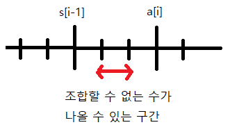

# 2437번 저울


### 문제


하나의 양팔 저울을 이용하여 물건의 무게를 측정하려고 한다. 이 저울의 양 팔의 끝에는 물건이나 추를 올려놓는 접시가 달려 있고, 양팔의 길이는 같다. 또한, 저울의 한쪽에는 저울추들만 놓을 수 있고, 다른 쪽에는 무게를 측정하려는 물건만 올려놓을 수 있다.


무게가 양의 정수인 N개의 저울추가 주어질 때, 이 추들을 사용하여 측정할 수 없는 양의 정수 무게 중 최솟값을 구하는 프로그램을 작성하시오.

예를 들어, 무게가 각각 3, 1, 6, 2, 7, 30, 1인 7개의 저울추가 주어졌을 때, 이 추들로 측정할 수 없는 양의 정수 무게 중 최솟값은 21이다. 

---

### 입력


첫 째 줄에는 저울추의 개수를 나타내는 양의 정수 N이 주어진다. N은 1 이상 1,000 이하이다. 둘째 줄에는 저울추의 무게를 나타내는 N개의 양의 정수가 빈칸을 사이에 두고 주어진다. 각 추의 무게는 1이상 1,000,000 이하이다.

---

### 출력


첫째 줄에 주어진 추들로 측정할 수 없는 양의 정수 무게 중 최솟값을 출력한다.

---

## Point


1. 배열 안의 숫자만을 이용해 특정 숫자를 만들 때 배열 안의 숫자들 중 만들고자 하는 숫자보다 작은 수들만의 조합을 생각해보면 된다. (오름차순으로 배열을 정렬하는 것이 효과적)

2. [a[0], a[1], a[2], ..., a[i], ...., a[n]] 에서 a[i-1] 까지의 합을 s[i-1]이라 하고 s[i-1] 까지는 조합으로 만들어낼 수 있었다고 가정해보자. 여기서 a[i] 까지 조합을 통해 얻을 수 있는 숫자들을 생각해보면

   a[i], a[i] + 1, ......, a[i] + s[i-1] 이 된다(0 ~ s[i-1] 까지 a[i-1] 까지의 숫자 조합으로 얻을 수 있기 때문에)

   

3. 조합할 수 없는 수가 존재하기 위해서는 위 그래프를 보면 알 수 있듯이 

   ​	a[i] > s[i-1] + 1

   이다. 


## CODE

```python
import sys

n = int(input())
lst = list(map(int,sys.stdin.readline().split()))
lst.sort()

s = 0
for i in lst:
    if i <= s + 1:	# a[i] > s[i-1] + 1 에 대한 조건문
        s += i
    else:
        break
print(s + 1)
```

