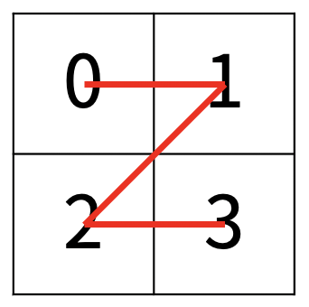
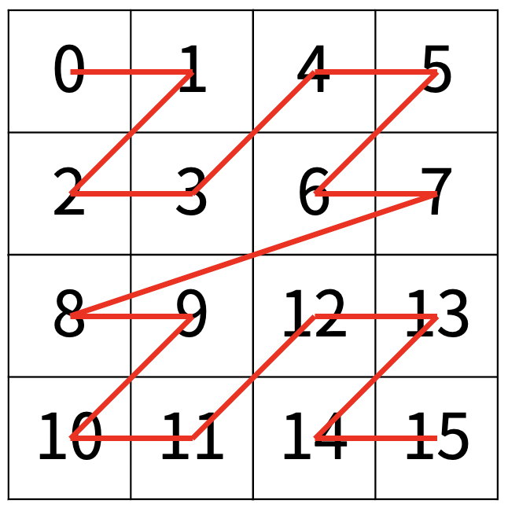
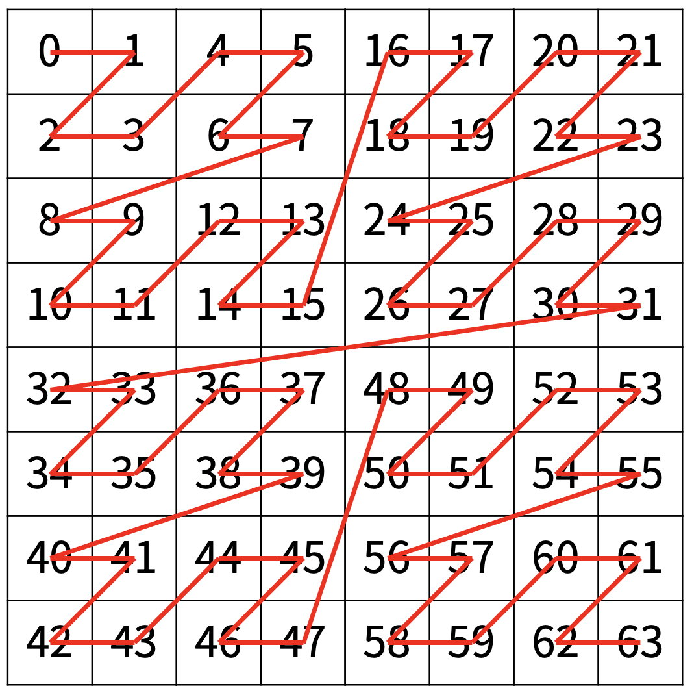

# 1074번 Z

### 문제


한수는 크기가 2N × 2N인 2차원 배열을 Z모양으로 탐색하려고 한다. 예를 들어, 2×2배열을 왼쪽 위칸, 오른쪽 위칸, 왼쪽 아래칸, 오른쪽 아래칸 순서대로 방문하면 Z모양이다.



N > 1인 경우, 배열을 크기가 2N-1 × 2N-1로 4등분 한 후에 재귀적으로 순서대로 방문한다.

다음 예는 22 × 22 크기의 배열을 방문한 순서이다.



N이 주어졌을 때, r행 c열을 몇 번째로 방문하는지 출력하는 프로그램을 작성하시오.

다음은 N=3일 때의 예이다.



---

### 입력


첫째 줄에 정수 N, r, c가 주어진다.

---

### 출력


r행 c열을 몇 번째로 방문했는지 출력한다.

---


## CODE

```python
import sys

n,x,y = map(int,sys.stdin.readline().split())
cnt = 0
n = 2**n

while n > 1:		# 사각형 크기가 1 x 1 이 될 때까지 반복
    if x < n//2 and y < n//2:
        pass		# 왼쪽 위
    elif x < n//2 and y >= n//2:
        cnt += (n**2)//4
        y -= n//2	# 오른쪽 위
    elif x >= n//2 and y < n//2:
        cnt += (n**2)//2
        x -= n//2	# 왼쪽 아래
    else:
        cnt += 3*(n**2)//4
        x -= n//2	# 오른쪽 아래
        y -= n//2
    n = n//2

print(cnt)

```

```python
import sys

n,x,y = map(int,sys.stdin.readline().split())

def sequence(x):
    if x == 1:
        return [[0,1],[2,3]]
    else:
        a_ = [w + [4**(x-1)+t for t in w] for w in sequence(x-1)] 
        b_ = [[2*(4**(x-1))+t for t in w] for w in a_]
        return a_ + b_

lst = sequence(n)
print(lst[x][y])
```


처음에 짰던 코드는 두 번째로 메모리 초과에 시간 초과가 나왔다. 2차원 배열을 리턴하는 재귀 함수를 썼던 게 패착이었다.

숫자 하나의 위치를 알기 위해 배열에 있는 모든 숫자들의 위치를 저장하기 때문에 매우매우매우 비효율적이다.


이를 해결하기 위해 같은 재귀 방식에서 cnt를 사용하여 사각형을 4분의 1씩 줄여나가면서 위치를 특정짓는 방식으로 바꿨다.  