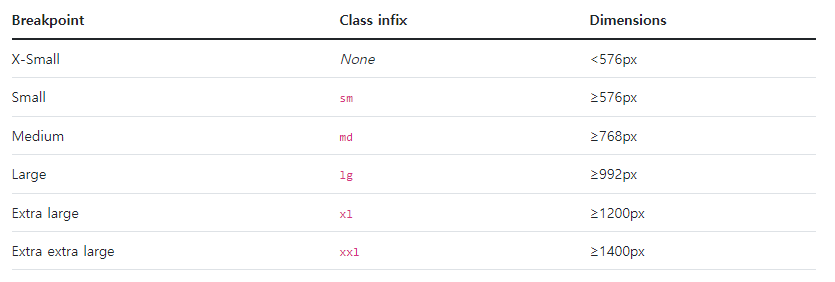

### float

- 둥둥 떠있는 상태 (absolute랑 비슷)
  - float : left , right
- clearing이 필수적
  - ::after clear:both

### flex

- container를 생성하여 그 안에 box model를 넣는다.

- main 축과 cross 축이 존재

- 속성
  - direction(shorthand) : row(-reverse), column(-reverse)
  - wrap(shorthand) : wrap, nowrap
  - justify-content(start,end,center,evenly,space-between,space-around)
  - align-content
  - align-items(stretch,start,end,center,baseline)
  - align-self : 한 개만 control
  - grow, order : 크기(열), 순서

## Bootstrap

- margin : m

- padding : p

- top : t , bottom : b , start : s , end : e , left+right : x , top+bottom : y
- 1 : 0.25rem, 2 : 0.5rem, 3 : 1rem, 4 : 1.5rem, 5 : 3rem
- color

 

- display : d

---

### Grid

- 구조:
  - column,gutter : col과 col 사이 간격, container : col를 담고 있는 공간
- 1 row의 사이즈는 12(약수가 많아서 12 사용)
- breakpoint:
  - container-fluid 사용하면 breakpoint 경계선에서 부드럽게 사이징이 된다.

