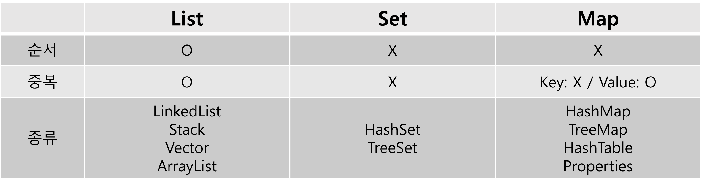

## 1. 컬렉션 프레임워크

#### 프레임웤이란?

'데이터 군을 저장하는 클래스들을 표준화한 설계'

뼈대나 기반 구조의 역할을 한다. (라이브러리 같은 경우 사용자가 상속받거나 주로 받아서 재사용하는 클래스들의 모음)

#### 컬렉션 프레임웍 :

다수의 데이터를 다루는 데 필요한 다양하고 풍부한 클래스를 제공

## 컬렉션 프레임웍의 핵심 인터페이스

![자바 - 컬렉션프레임워크(Collection Framework)](data:image/png;base64,iVBORw0KGgoAAAANSUhEUgAAAR8AAACvCAMAAADzNCq+AAAAflBMVEX///81PkhZYWmmqa3b3N65vL9haG9BSVKws7ZcY2rU1tjo6es0PkjBw8edoKTNz9AqNUDy8vOBh405Qkz5+fmLj5OTl5x7gIVPV2BDS1R0eX9HT1jf4OH19vaPk5hpb3Ztc3kdKji0t7pMVFwbKTe+wcOYnaGipqolMDwQITDtE0YFAAAJB0lEQVR4nO2diXqiOhSAwyIBAkI87IswUtT7/i94E+y0amsUlxad88/XsRQT5fecJGAAQhAEQRAEQRAEQRAEQRAEUVPo0yT5bTHvWADa9ABY/LaYdxpojckxtybkZ/7bb+ErfKGhHwXoRw36UYN+1KAfNehHDfpRg37UoB816EcN+lGDftSgHzXoR80/5CfqV2x0oSf3w5aL1CXEWKSr6Nxz+w6SeuwLPI0fljhdVvhHG1hl4PkkSjUvOe0nioZ1cwpNNfZNPYkfvtZAomWzg79XOgXph8L6pJ95uG1kYvXZy8YPXwAFfZFS8f/BJl7gh69z2rqMExLMXrX9MSily4rzoCkDsVjby3g5k6KO/HAjjhN/VyZYx0ubE55ked41rU2CZGnIMny1jJPZLuXiRVDbcXy68XoKP0yntBg2oZJ6fCcXqZZbwbGf3qFyRSrChKWl/DXzeQF5TsFLiE21QkRRrw+ldVmTBd7aEmXo4lRkPYWfAHIv+Fjqc0ozK6MgYunAj18CdayOwoKLymhu6dTT3Y2e51mRrohdQspJr72X7kSNDc2hFAuUGide+in82FpefvQ8IiCo5TNfmEmjfT91CiIJ5Yos8L28nFduEgsJRk6FF7LzE1lUlp6Jh5hLP+WM+SKElida7qfws/Ly/MNP1VGtF4820Izv+2EiDtJ1koiHWQJU5lItt1r4KWT6DH4YpXm/+6NVCT/Dt3/Jk/sR+aX5HwsiveTmmiIrzH0/Zp7nEIYhQLjZ79AO/ASU6lJ10NHMlX5sMoyMntoPF9nQyBQhrBriRzZGM6AdO4gf0fLI0VEkNlXEj8ypYWB44KeitPSHhV38eCvy/H7ISsTMwmXML7KAtyDHM6747IvD9kc2TC6v7E1Eeo92Nqs2iTv4adyK7/zUDhWledCKCvnL+OFLEHlRFKJnzvgsl7+LLr/sD/uvvhQr0gZyI6p10X8VDdUcRvyc5o3lv/dfKzHSdFJRuvPJy/gh9dwb9i9CyyWRsdvVoHYk/Oz2v0AT+1/RZljhyS139aFAKPrtqPAohEti59LP39KeTEUx/hnaH9Di5/YjDBlF0ya7XozP26YwZINUpY0YJkZJYxmyqWFrscIenhPN0qZd74Z9m7aNTdK3TSLLsI0sPfhYNNbQFTbN5tn9/BLoRw36UYN+1KAfNehHDfpRg37UoB816EcN+lGDftSgHzXoRw36UYN+1KAfNfWU/MSVOTWCYjrnx9HMmh7dZPxYuyk+94BSere6vPS3xbzjz+6FoYPV360297fF3B3WQvHb72HKVOhHCfpRg37UoB816EcN+lHzr/bvdeUGlzBzoLnsmeboEw4mjLl0SvA0+U+TP58PRwtAc/r9mqMFyKz5+Dn1E8XXwQvvjAfQBOdf+hmoMigT8+xZTKOI/DSHgt+1zt9iCdQ//6zR2AD2A6r9eSg85kJgljwd4fnhofeYhmKjNa/QRAdeZj6kYt/L0I8CFnqvMAh6mB+OfpSgHzXoRw36UYN+1KAfNehHzT38RJdxj7d7ign7MfvN/CJs/3Ej9cn6qW1HUx6E+1zwoHhYKk/WTwAQ6rpzATqFxx0Xn6qfSAfr4qyZ5/nqhtdSMVk/4PWXv5Zz8kIWtzJZP6E2YgKMpT1qDuGL+PHQjwqMHzUYP2rQjxr0owb9qHmcH9fLHrPv8lx+mOt/zwY648Qq96KrPrKg/7b0CuBExcEl36v+qB++LnM6mvzooprf1rzIR9ecl+n5Pat9P5GTyX2NPnNOmb1t/FPHHmTjb9DVwfacoMjR6PiaqaafPaZ14CeDgsmLfWaMMNOUl2E0WWXuSb4tfoIS4sAdjd+CdSYVDFqux9c87+Ds7vahH0p74pc046613eo+ScKm3LafCXibH9srr5pK0ZfZmbkLsVZccXQzSs+fvHPox3JanmZ6xplvrsoimmtWv/Y+J4jc5Cdaau1VBU29VCcYT7WrJsfE2tmTdw79xJs8Kddpxs3C0WkbzUUAcuvzANFNfsRWxFcVZA5Vz3H6OT9mqzXuIjMLnZmZ9GMTpr+un/Mnfx35qe1wXks/nb0E4Udz7NiL75Nfz++HpjUPGIkpm4lmmVrRnKbdtvgc+N/kp56en3H5RfhupMq5/KnFwxpmnO8NX28a/zx9/Hwl8Q47jn87v74SzA93ql/Nz8j8Osur+bk1fo65d/vM2dC4RcbeHNz6y+76dX44Y3x/UB3xL0Psafn5Jn7Wb0P7Vi/DjzfBFvNjQdf4qY3sz1uX7B366dsvGzr5/Npouy8nWfDx2TJ9cfw5X+PH9tLZLN0/ZcH+OgF98vHz7idaFZW8gm9hcN6UWXN0XOYaP628jDivxEilWrapMGNn1GqPqpmWn2/an79+1p5Zx9TR8w3T81Jvb/eTaoU7DPt96MSupEE2Jc30zeGT7p9fdx4f/vUzB5NZbU1cRvh98svVtVC3KxLpjUmi2KmIDVflF2iXz09g+i3zE9R+6jhfyhvoiPbnHu0zMe0UvMashrvOx2XwrZ8L4qcB56ID1YIqybsbztFS+yF8lXlWcDc/svVptI0LsH1724azK+OHzELQ2/QSCivXbpkf9V374w2+Bz8iq9ysqO/jp97Iz7z35pW8j8pwIwgbvny2l/iJjIyC5l2AvGXALRMQv4sfWAe+70o/VbMJZmVaM0tfzQ4NXeHHpaURBJboxGJYBsHClndpiY+vZXNBfgkqex5fQmLcdgbbd+PDcPvnz39ptA5dti7fwlZ2xOWbdXP/xWcp/PnjrGrCElFv4UeEpeF2fP/+g3zjhw0XAWOEuTWJquErE/l4FKVXtT/c3FVHalEvf3+xo4Z2Wn6e8vjYD/KU++8/CPpRM0E/k8qvCbY/GD9KphU/E/SD8aME/aiZVn7V8ZW7t5WeP2j+xqTihxhaeVW5WZmdOYa3uCoQohSuC+gH4YO2qdho/AZOTvh7Zw6dMbrmal1O69pAvPDoRWfiHdLB9tw0ONZBObpmnUL2I9t9MWyRlePnr5bO+U/ZbLrx81ezC+av/jBBb49lddFZwXWwGl3x6135GUEQBEEQBEEQBEEQBEEQBEEQBLkH/wOgZhpBxz97ggAAAABJRU5ErkJggg==)

각 컬렉션을 다루는 데 필요한 3개의 인터페이스가 정의되어있고 이 중 List와 Set의 공통된 부분을 다시 뽑아서 새로운 인터페이스인 Collection을 추가로 정의

Vector나 HashTable은 컬렉션 프레임웤이 나오기 전에 있었던 클래스이고 지금도 사용할 수 있지만 대신 ArrayList나 HashMap을 사용하는 것을 추천

