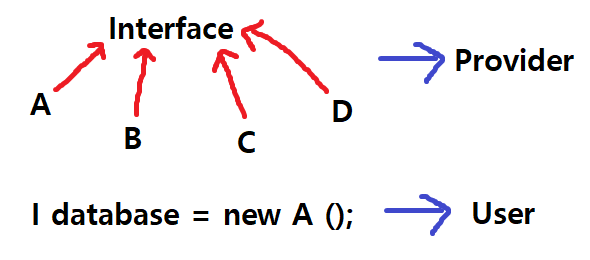

## 인터페이스


### 인터페이스의 장점


1. 개발시간의 단축 : 인터페이스를 구현하는 클래스를 만드는 데 동시에 개발이 가능하기 때문
2. 표준화 가능 : 정형화된 프로그램 개발 가능
3. 관계가 없는 클래스들을 관계를 맺어줄 수 있다.
4. 독립적인 클래스 구현이 가능 : 선언과 구현이 분리되어 있기 때문에 클래스 변경에 따른 영향이 미치지 않는다.





### 관계가 없는 클래스들을 연결


조상클래스 Building을 상속받는 클래스 Academy, Bunker, Factory, Barrack 이 있을 때 Factory와 Barrack만을 관계를 지어주려고 할 때 인터페이스를 사용할 수 있다.


이미 Building을 상속받고 있기 때문에 다른 공통 조상클래스를 만들어 줄 수 없기 때문


```java
class Building{}

interface Liftable{
    void liftoff();
    void move(int x,int y);
    void stop();
    void land();
}

class LiftableImpl implements Liftable{
    public void liftoff(){};
    public void move(int x, int y){};
    public void stop(){};
    public void land(){};
}

class Academy extends Building{}
class Bunker extends Building{}
class Factory extends Building implements Liftable{
    LiftableImpl impl = new LiftableImpl();
    public void liftoff(){ impl.liftoff(); };
    public void move(int x, int y){ impl.move(x,y); };
    public void stop(){ impl.stop(); };
    public void land(){ impl.land(); };
}
class Barrack extends Building implements Liftable {
    LiftableImpl impl = new LiftableImpl();
    public void liftoff() { impl.liftoff(); };
    public void move(int x, int y) {impl.move(x, y);};
    public void stop() { impl.stop(); };
    public void land() { impl.land(); };
}

public class Relation {
    public static void main(String[] args) {

    }
}
```

 

모든 인터페이스로 이어준 클래스들 안에서 메서드 내용이 동일할 때 이것을 한 곳에서 관리해주는 것이 더욱 편하다.


### 인터페이스의 이해


```
- 클래스를 사용하는 쪽과 클래스를 제공하는 쪽이 분리되어 있다.
- 메서드를 사용하는 쪽에서는 사용하려는 메서드의 선언부만 알면 된다. (내용을 몰라도 된다.)
```


클래스 간의 관계를 직접적인 관계가 아닌 간접적인 관계로 연결된다. 제공자 측에 문제가 생겨도 에러가 발생하지 않는다!


```java
class A{
    public void methodA(B b){
        b.methodB();
    }
}

class B{
    public void methodB(){
        System.out.println("methodB");
    }
}

class Interface {
    public static void main(String[] args){
        A a = new A();
        a.methodA(new B());
    }
}
```


```java
interface I{
    void methodB();
}

class A{
    public void methodA(I i){
        I.methodB();
    }
}

class B implements I{
    public void methodB(){
        System.out.println("methodB");
    }
}

class C implements I{
    public vdid methodB(){
        System.out.println("methodB");
    }
}

class Interface {
    public static void main(String[] args){
        A a = new A();
        a.methodA(new B());
        a.methodA(InstanceManager.getInstance())
    }
}
```


위의 코드에서 아래 코드로 변경하고 B 클래스의 메서드가 아닌 C 클래스의 메서드를 사용하는 방향으로 바꾼다고 하면 C 클래스 또한 인터페이스를 구현하는 클래스라면 수정해야 하는 부분은 하나다.


인스턴스를 생성하는 부분에서 B 클래스의 인스턴스를 생성했는 데 이를 한 번에 해결하기 위해서 관련 인스턴스를 생성할 때 new 연산자를 사용하는 방법이 아닌 다른 메서드를 이용하여 일괄적으로 처리하는 것이 좋다.


```java
class InstanceManager {
    public static I getInstance(){
        return new C; // 이 부분만 한 번 변경하면 일괄적으로 처리된다.
    }
}
```


### static 메서드와 디폴트 메서드


인터페이스를 나중에 메서드를 추가할 때는 사용자 측에 문제가 생긴다. (사용자와 제공자가 분리되어 있어서)


이를 보완하기 위해 default 메서드를 제공한다. 이 메서드는 사용자 측 클래스에 무조건 있어야 하지 않는다.

대신 충돌을 막기 위해 아래와 같은 규칙이 있다.

```
1. 여러 인터페이스의 디폴트 메서드 간의 충돌
- 인터페이스를 구현한 클래스에서 메서드를 오버라이딩
2. 디폴트 메서드와 조상 클래스의 메서드 간의 충돌
- 조상 클래스의 메서드가 우선
```

