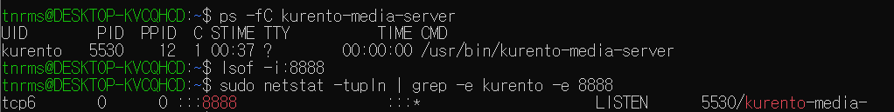
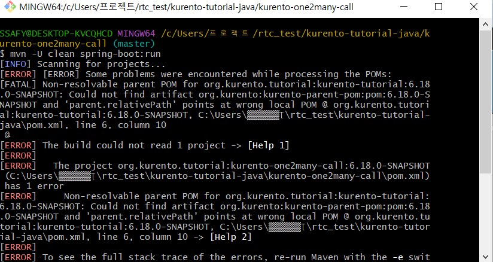
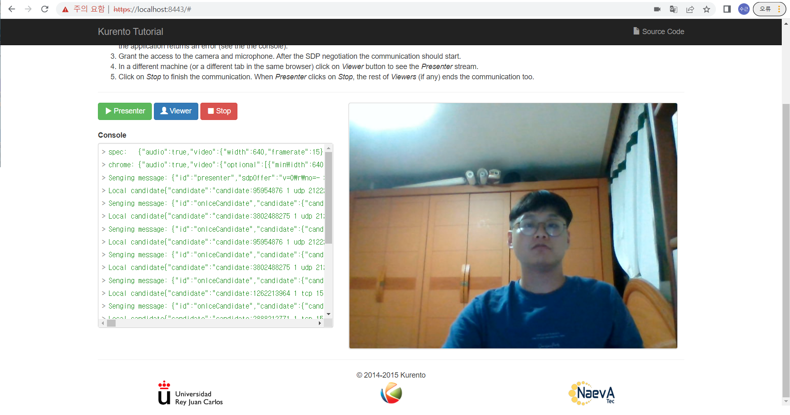

#### 도커에 kurento 이미지 pull 받고 kurento media 서버 실행시키기


해결 방법을 끝내 찾지 못함....

ubuntu 내에 kurento media 서버를 설치하고 예제 코드를 실행하는 것으로 우회


#### ubuntu에서 kurento media 서버 설치


1. GnuPG가 설치

   ```
   sudo apt-get update && sudo apt-get install --no-install-recommends --yes \
       gnupg
   ```

2. 시스템에 설치된 Ubuntu 버전을 정의

   ```
   # Run ONLY ONE of these lines:
   DISTRO="xenial"  # KMS for Ubuntu 16.04 (Xenial)
   DISTRO="bionic"  # KMS for Ubuntu 18.04 (Bionic)

   ```

3. 시스템 구성에 Kurento 저장소를 추가

   ```
   sudo apt-key adv --keyserver keyserver.ubuntu.com --recv-keys 5AFA7A83

   ```

   ```
   sudo tee "/etc/apt/sources.list.d/kurento.list" >/dev/null <<EOF
   # Kurento Media Server - Release packages
   deb [arch=amd64] http://ubuntu.openvidu.io/6.13.0 $DISTRO kms6
   EOF

   ```

4. KMS 설치 :

   ```
   sudo apt-get update && sudo apt-get install --yes kurento-media-server
   ```


5. kms 실행 및 중지

   ```
   sudo service kurento-media-server start
   sudo service kurento-media-server stop
   ```

   ​

#### 서버 실행 화면





포트를 할당받아 정상적으로 작동하는 것을 확인


#### 예제 코드 실행



자바 예제 코드를 실행하려 했으나 pom 파일의 문제가 있어 실행이 되지 않아 node.js 예제 코드로 실행


test 폴더를 만들고 

```
$ git clone https://github.com/Kurento/kurento-tutorial-node.git cd kurento-tutrial-node/kurento-one2many-call
```

소스 코드를 clone 한 뒤

```
$ git checkout 6.9.0
```

브랜치를 바꾼 뒤 실행

```
$ npm start
```





예제 코드 실행 성공!


#### 해결해야 할 점


- 예제 코드를 커스터마이징하여 프로젝트에 잘 적용해야함
- 자바에서 예제 코드가 실행되지 않아 이 점을 해결해야 함