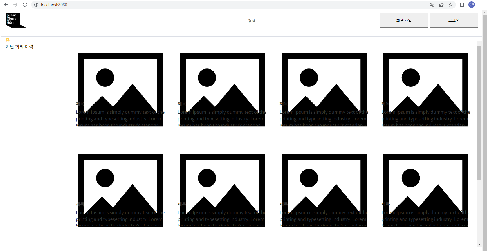

#### Backend 환경 설정 및 skeleton 파일 실행

- mysql 5.7 설치 : 설치 후 db 생성(utf-8) properties에서 해당 db 접속 및 계정 아이디와 비밀번호 설정
- ddl 설정을 update에서 create로 변경(entity관련해서 테이블을 처음 설정하는 것이기 때문에)
- 서버 실행을 application.java를 run하는 방식으로 진행
- static 리소스 폴더 경로가 지정되어 있어 dist 폴더를 해당 위치로 변경

아래와 같이 잘 실행되는 것을 확인할 수 있다.

### 해결해야 할 점

- 현재 index.html에서 자바스크립트 파일에 의해 이미지 사진이 생성되는 것을 확인할 수 있었고 이 코드를 분석해 잘 활용해야 할 것 같다.

  