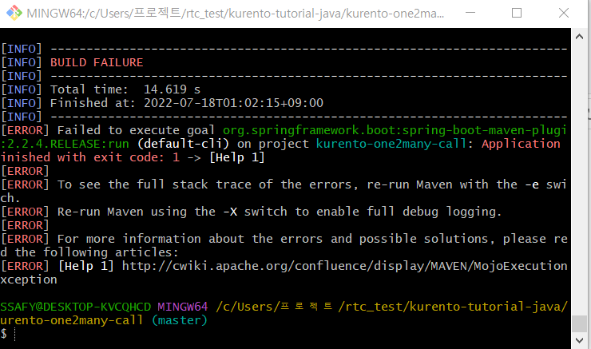
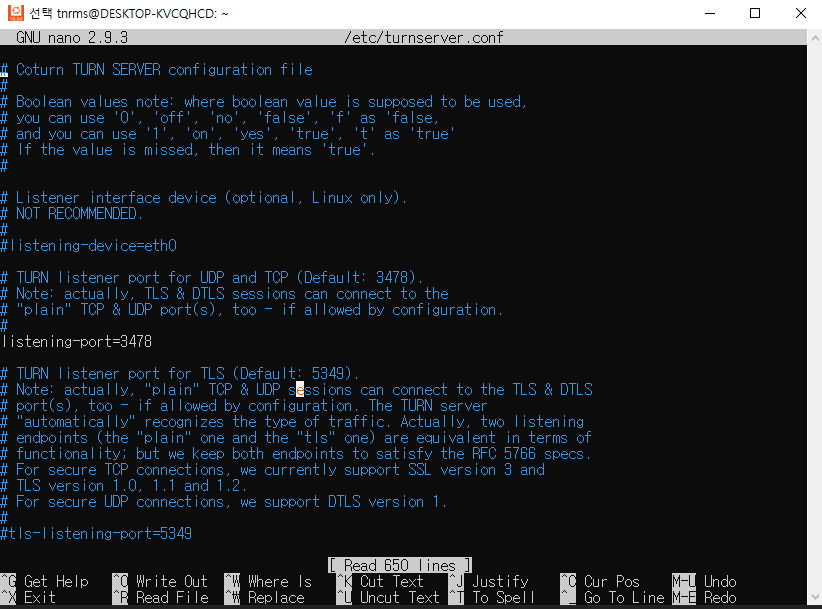

#### 자바에서 예제 코드 실행

1차적으로 snapshot이 들어간 pom.xml을 수정하고 실행했으나 아래와 같은 에러 발생 - 미해결

spring-boot maven plugin 부분에서 버젼 문제인 걸로 추정되나 maven repository에서 사용가능한 버젼으로 pom.xml에서 명시하고 다시 빌드해도 똑같은 에러가 발생한다.

#### Ubuntu 환경 내에서 STUN 서버 환경 설정

- 명세서 내용을 차례대로 수행
- 기존 Ubuntu에서 실행시킨 Kurento-media-server를 도커에서 이미지를 pull 받아 실행시키는 것으로 다시 변경(명세서 내용대로)
- coturn을 깔고 nano 편집기를 이용해서 파일 수정(이 부분에서 ec2 퍼블릭 ip주소가 필요한 듯 해서 nano 편집기 내에서 파일 수정/저장 하는 법을 학습)

#### 더 학습해볼 만한 내용

- 튜토리얼 예제를 수정하여 스켈레톤 파일과 결합을 하기 위해 WebRtc를 스프링 내에서 직접 구현한 다른 예제 코드를 찾아 학습할 필요가 있다.
- Swagger 활용을 위한 학습 및 스켈레톤 코드 Swaggger 상에서 어떻게 동작하는 지 확인

