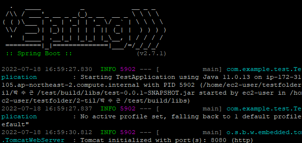

#### ec2 계정 생성 및 인스턴스 생성

- AWS 공식홈페이지에서 계정을 만들고 보안을 위해 MFA(다른 디바이스와 이중 보안 체크하는 OTP와 비슷한 개념인듯) 설정
- 인스턴스를 생성 및 설정
  - 보안그룹에 스프링부트를 실행하기 위해 8080 포트를 추가한다.(사용자 지정 TCP로 추가)
  - Elastic IP를 이용해 인스턴스를 중지하고 재시작해도 public IP 주소가 변동이 있지 않게 설정
  - key 페어를 다운받고 이를 putty를 이용하여 이 키를 사용하여 ec2에 접속
- ec2 내에 자바 설치, git을 통해 ec2 내에 프로젝트 파일을 clone한다.
- jar파일로 빌드

참고자료 : https://victorydntmd.tistory.com/category/Cloud/AWS?page=1

(EC2 인스턴스 생성, Elastic IP 고정, IAM 계정 생성)