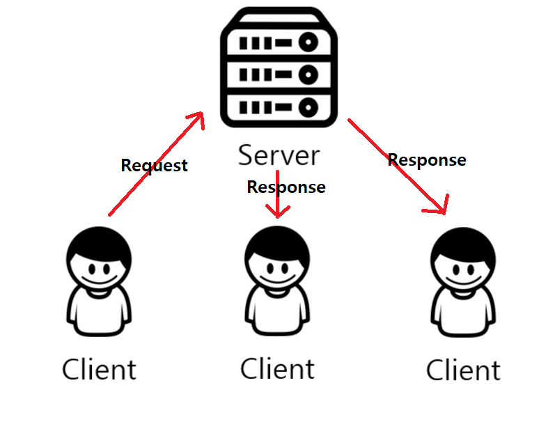
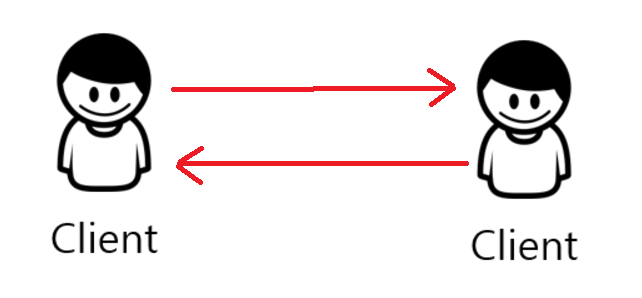
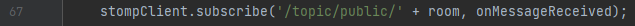
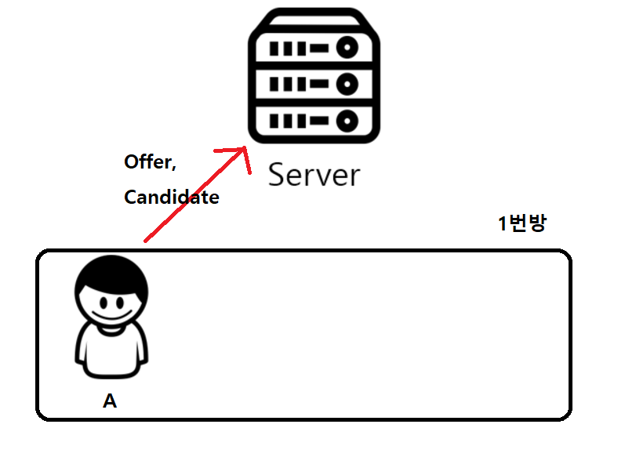
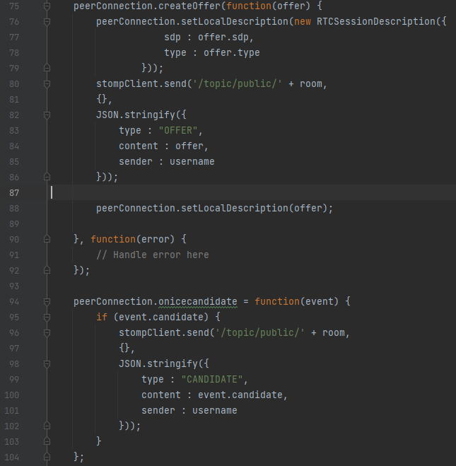
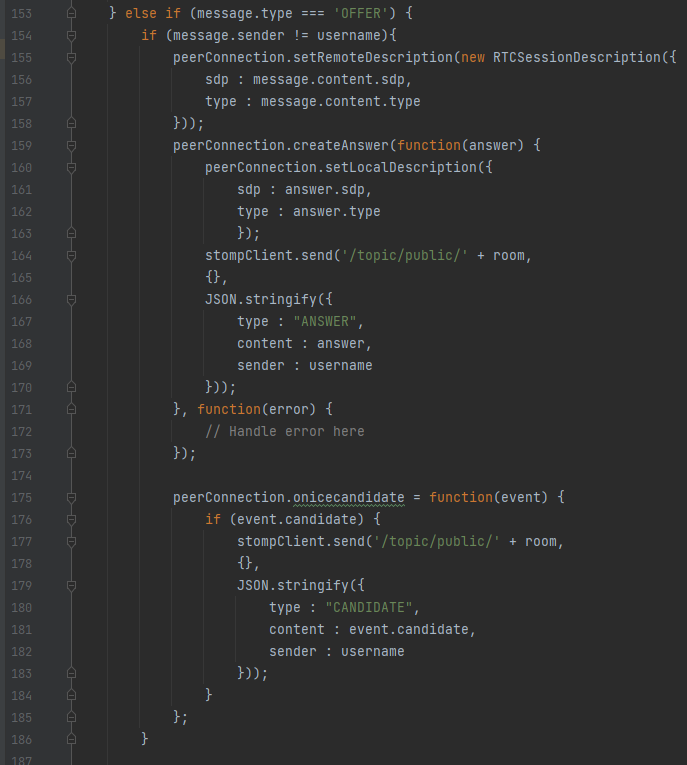
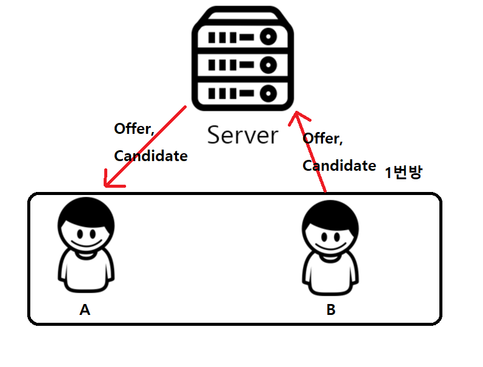
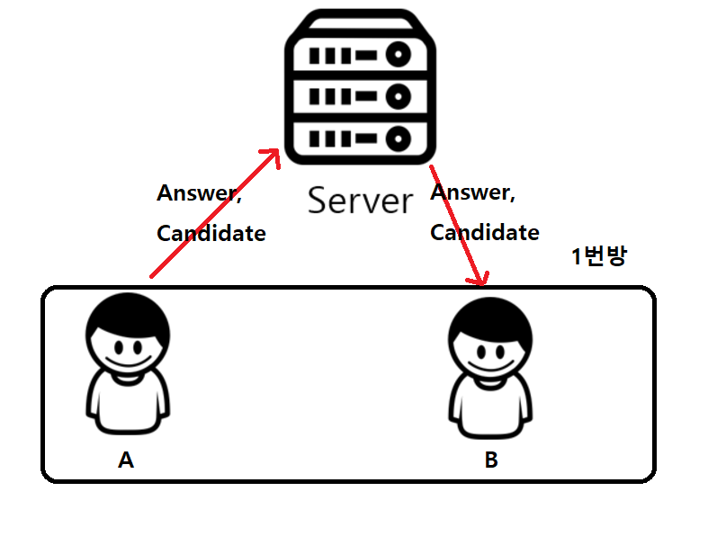
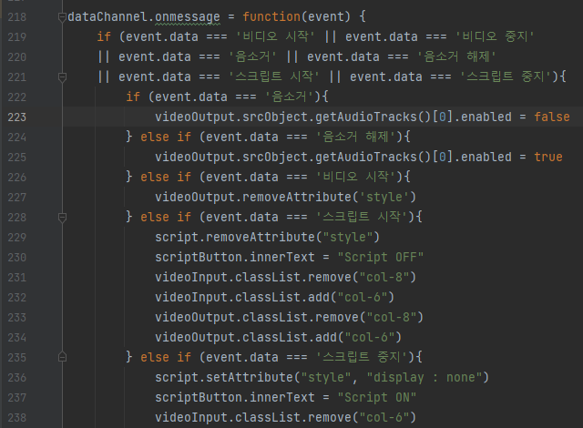
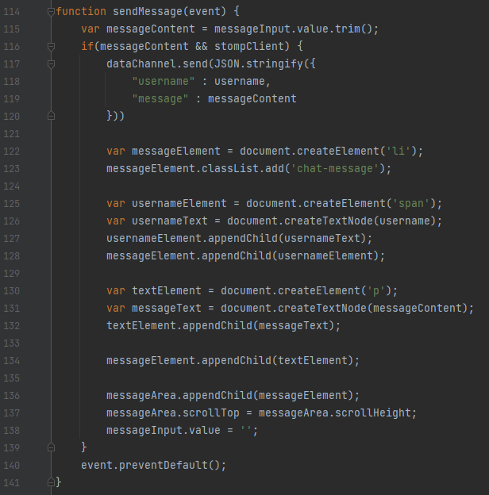

## WebRTC 란?

### HTTP vs WebSocket vs WebRTC

http 통신은 Client가 Server에 요청을 보내야 Server가 그에 대한 응답을 하고 통신이 끝난 뒤 연결을 끊는다.

WebSocket 통신은 HTTP와 달리 Client 연결이 한번 연결되면 이를 유지하기 때문에 Server가 단독으로 Client에게 응답을 보낼 수도 있고 A에게 받은 요청에 대한 응답을 B에게도 할 수 있다.

WebRTC 통신은 서버를 거치지 않고 p2p로 연결되어 통신을 한다.

### WebRTC를 브라우저에서 지원하는 API를 이용해 구현

피어 간을 연결하기 위해서는 상대방까지의 경로와 주소를 알아야 한다. 우선 WebSocket 통신을 통해 필요한 정보를 얻어 RTC 연결을 한다.

WebSocket 통신을 통해 오가는 메세지는 3가지 종류로 분류할 수 있다.

- Offer : 다른 피어에게 통신을 위한 제안을 보낸다. (SDP에 대한 정보가 실려있다.)
- Answer : 다른 피어에게서 Offer를 받았을 때 그것에 대한 응답
- Candidate : 상대방이 찾아와야 하는 라우터 주소에 대한 정보(STUN,TURN 서버가 동작해야 candidate를 보낼 수 있다.)

### WebSocket에서의 Subscribe 란?

소켓 통신을 시작할 때 Client가 어떤 곳으로 오는 데이터를 수신을 할지 정할 수 있다.

 

위의 코드를 보면 Client는 '/topic/public/' 에 방 아이디를 더한 url에 오는 데이터를 수신하고 데이터를 수신할 시 onMessageReceived를 콜백함수로 가지고 있는 것을 확인할 수 있다.

## RTC 통신을 연결되는 전체 로직

두 명의 유저가 접속하고 RTC 연결이 되는 과정을 통해 RTC 통신이 연결되는 전체 로직을 설명한다.

### 1. 유저 A가 1번 방에 접속한다. 

유저 A가 접속을 하면 1번 방에 들어오는 데이터를 Subscribe를 하고 Offer 데이터와 Candidate 데이터를 1번방에 있는 유저에게 뿌린다.

그러나 현재 1번방에 접속한 유저는 A밖에 없기 때문에 아무런 동작이 일어나지 않는다.

### 2. 유저 B가 1번 방에 접속한다.

유저 B 또한 유저 A 때와 같이 접속하면 Offer, Candidate를 서버로 보낸다.

이번엔 1번방을 Subscribe 하고 있는 유저 A가 있기 때문에 Server는 A에게 B가 보낸 Offer와 Candidate데이터를 전달해준다.

(위의 Subscribe의 매개변수로 있던 콜백함수 onMessageReceived가 동작하게 된다.)

### 3. A는 B의 Offer와 Candidate를 수신하고 그에 대한 Answer와 Candidate를 보낸다. 

A는 B의 Offer,Candidate를 수신하고 그에 대한 answer를 보낸다. 그리고 Candidate를 다시 보낸다.

### RTC 통신을 위한 dataChannel 연결이 된다.

이제부터 WebSocket이 아닌 dataChannel을 통해 A,B를 통신을 할 수 있게 된다.

​						dataChannel가 message 수신할 때의 콜백함수

​						dataChannel가 message를 송신하는 함수

