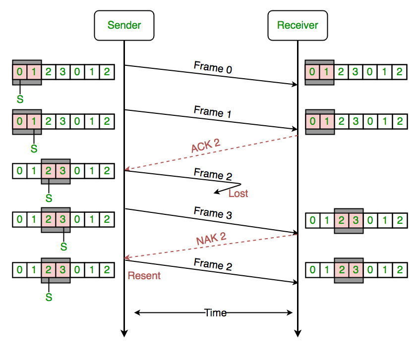

## 물리 계층

### 물리 계층이란?

- 하드웨어로 표현됨
- 네트워크 장치의 전기적, 기계적인 속성 및 전송하는 수단
- **상위 계층인 데이터 링크 계층의 프레임을 신호로 인코딩하여 네트워크 장치로 전송**

### 장비

|    **허브(Hub)**     | 여러 대의 컴퓨터를 연결하여 네트워크로 보내거나, 하나의 네트워크로 수신된 정보를 여러 대의 컴퓨터로 송신하기 위한 장비 |
| :------------------: | ------------------------------------------------------------ |
| **리피터(Repeater)** | 디지털 신호를 증폭시켜 주는 역할을 하여 신호가 약해지지 않고 컴퓨터로 수신되도록 하는 장비 |

## 데이터링크 계층

### 역할

1. 인접한 네트워크 노드들끼리 데이터를 전송하는 역할
2. 물리계층에서 발생하는 오류를 감지하고 수정하는 역할

헤더에는 IP가 아닌 물리적인(?)  주소인 MAC 주소가 담겨있다.

MAC Address : IP는 동적으로 할당받는 주소이며, 고유한 값이 될 수 없다. 그래서 물리적인 NIC를 식별하여 Frame을 보내야 하는데, NIC 고유 식별정보가 바로 MAC 이다. ( Media Access Control)

### 기능

1. 프레임 생성 기능 : 데이터를 프레임 단위로 만듬 앞: 헤더(출발지,목적지 주소, 데이터 내용 정의) 뒤: 트레일러(비트 에러 감지)

2. 회선 제어 기능 :  컴퓨터 신호 간의 충돌을 방지

   - ENQ/ACK 기법 : 송신측에서 Enquiry를 보내어 데이터가 필요한 지 물어보면 수신측은 Acknowledge를 보냄. ACK가 송신측에 전달되면, 데이터를 수신측에 보내고 수신측은 다시 잘 받았다는 신호를 보냄. 마지막으로 송신측이 EOT(End Of Transmission)을 보내고 송수신 종료

   

   - Polling 기법 : 1대 다 전송 기법, Select(송신측이 수신측 선택 전송) 모드와 Poll(송신측이 먼저 수신측한테 데이터 받을 건지 물어봄) 모드가 있다.

   < 셀렉트 모드 >

   

   < 폴 모드 >

3. 흐름 제어 기능 : 컴퓨터 마다 성능과 네트워크 환경이 다르기 때문에 데이터를 주고 받을 때 속도 차이가 날 수 있음. 이러한 속도 차이를 해결하기 위해 흐름을 제어.

   - Stop & Wait: 데이터를 송신하고 ACK를 받을 때 까지 기다리는 방식 비효율적 ACK가 오지 않을 경우 프레임 소멸 에러 발생. 이럴 때는 유휴 시간(idle time) 경과 후 프레임을 다시 보냄. 프레임을 다시 보낼 때 수신 측은 시퀀스 넘버를 통해 중복된 프레임인지 확인.
   - Sliding Window: 여러 프레임을 한꺼번에 보낼 수 있음. ACK 응답이 필요 x 윈도우 크기는 송신측과 수신측 프레임이 저장되는 버퍼 크기

   

4. 오류 제어 기능 : 네트워크 상의 문제나 전기적인 문제로 프레임이 소멸되는 등의 오류가 있을 수 있음. 전송 중에 오류나 손실이 발생하면 이를 탐지하고 수정함. 프레임이 손상되어 재전송을 수행하는 과정을 ARQ(Automatic Repeat Request)

   - Stop & Wait ARQ : 프레임이 손상되어 수신측에서 NAK를 전송하거나 주어진 시간 안에 수신 측이 ACK를 안 보내면 프레임 재전송
   - Go Back n ARQ : 송신측이 여러 프레임을 한꺼번에 전송. 프레임 1~3을 한 번에 보내고 프레임 2에 문제가 있는 경우 모든 프레임을 폐기하고 NAK를 보냄. 송신측은 다시 프레임 1~3 보냄
   - Selective Repeat ARQ : 위의 Go Back n ARQ 방식의 문제점을 보완. 위의 예시에서 문제가 생긴 프레임만을 보냄

   

   

