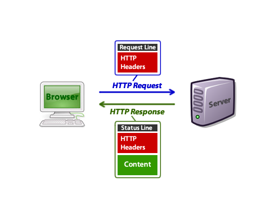

# HTTP (HyperText Transfer Protocol)

텍스트 기반의 통신 규약으로 **인터넷에서 데이터를 주고받을 수 있는 프로토콜**이다. 모든 프로그램이 이 규약에 맞춰 개발해서 서로 정보를 교환한다.


## HTTP 동작

클라이언트 즉, 사용자가 브라우저를 통해서 어떠한 서비스를 url을 통하거나 다른 것을 통해서 요청(request)을 하면 서버에서는 해당 요청사항에 맞는 결과를 찾아서 사용자에게 응답(response)하는 형태로 동작한다.


> **클라이언트**
>
> 서버에게 요청을 보내는 리소스 사용자 ex) 웹 브라우저, 모바일 애플리케이션, IoT 등
>
> **서버**
>
> 클라이언트에게 요청에 대한 응답을 제공하는 리소스 관리자


HTML 문서만이 HTTP 통신을 위한 유일한 정보 문서는 아니다.
(Plain text,JSON 데이터 및 XML과 같은 형태의 정보도 가능하다) 

보통은 클라이언트가 어떤 정보를 HTML 형태로 받고 싶은지, JSON 형태로 받고 싶은지 명시해주는 경우가 많다.



## HTTP 특징

- HTTP 메시지는 서버와 클라이언트에 의해 해석이 된다.

- TCP/ IP를 이용하는 응용 프로토콜이다.
  (컴퓨터와 컴퓨터간에 데이터를 전송 할 수 있도록 하는 장치로 인터넷이라는 거대한 통신망을 통해 원하는 정보(데이터)를 주고 받는 기능을 이용하는 응용 프로토콜)

- HTTP는 연결 상태를 유지하지 않는 **비연결성(무상태) 프로토콜**이다. 서버가 두 요청 간에 어떠한 상태나 데이터를 유지하지 않음을 의미한다.

  (이러한 단점을 해결하기 위해 Cookie와 Session이 등장하였다.)

- HTTP는 연결을 유지하지 않는 프로토콜이기 때문에 요청/응답 방식으로 동작한다.


# Request (요청)

**클라이언트가 서버에게 연락하는 것**을 요청이라고 하며 요청을 보낼때는 요청에 대한 정보를 담아 서버로 보낸다.


## Request Method (요청의 종류)

- **GET** : 자료를 **요청**할 때 사용

- **POST** : 자료의 **생성**을 요청할 때 사용

- **PUT** : 자료의 **수정**을 요청할 때 사용

- **PATCH** :

   변경 가능한 리소스의 부분 업데이트에 사용되며 항상 리소스 식별 정보를 포함해야 한다.
   **PUT을 사용해 전체 객체를 업데이트하는 것이 관례여서 거의 사용되지 않는다.**

- **DELETE** : 자료의 **삭제**를 요청할 때 사용


## Request HTTP 메시지 예시

```null
GET https://naver.com HTTP/1.1										  // 시작줄
User-Agent: Mozilla/5.0 (Windows NT 10.0; Win64; x64) ...			  // 헤더
Upgrade-Insecure-Requests: 1
```

### 1. 시작줄 (첫 줄)

첫 줄은 시작줄로 **메서드 구조 버전**으로 구성되었다.

- GET : HTTP Method
- https://naver.com : 사이트 주소
- HTTP/1.1 : HTTP 버전


### 2. 헤더 (두 번째 줄부터)

두번째 줄부터는 헤더이며 **요청에 대한 정보**를 담고 있다. User-Agent, Upgrade-Insecure-Requests 등등이 헤더에 해당되며 헤더의 종류는 매우 많다.


### 3. 본문 (헤더에서 한 줄 띄고)

본문은 **요청을 할 때 함께 보낼 데이터를 담는 부분**이다. 현재 예시에는 단순히 주소로만 요청을 보내고 있고 따로 데이터를 담아 보내지 않기 때문에 본문이 비어있다.


# Response (응답)

**서버가 요청에 대한 답변을 클라이언트에게 보내는 것**을 응답이라고 한다.


## Status Code (상태 코드)

상태 코드에는 굉장히 많은 종류가 있다. 모두 숫자 세 자리로 이루어져 있으며, 아래와 같이 크게 다섯 부류로 나눌 수 있다.

- **1XX (조건부 응답)** : 요청을 받았으며 작업을 계속한다.
- **2XX (성공)** : 클라이언트가 요청한 동작을 수신하여 이해했고 승낙했으며 성공적으로 처리했음을 가리킨다.
- **3XX (리다이렉션 완료)** : 클라이언트는 요청을 마치기 위해 추가 동작을 취해야 한다.
- **4XX (요청 오류)** : 클라이언트에 오류가 있음을 나타낸다.
- **5XX (서버 오류)** : 서버가 유효한 요청을 명백하게 수행하지 못했음을 나타낸다.


## Response HTTP 메시지 예시

```null
HTTP/1.1 200 OK														// 시작줄
Connection: keep-alive												 // 헤더
Content-Encoding: gzip												 
Content-Length: 35653
Content-Type: text/html;

<!DOCTYPE html><html lang="ko" data-reactroot=""><head><title...
```


### 1. 시작줄 (첫 줄)

첫 줄은 **버전 상태코드 상태메시지**로 구성되어 있다. 200은 성공적인 요청이었다는 뜻이다.


### 2. 헤더 (두 번째 줄부터)

두 번째 줄부터는 헤더로 **응답에 대한 정보를 담고 있다.**


### 3. 본문 (헤더 뒤부터)

응답에는 대부분의 경우 본문이 있다. 보통 데이터를 요청하고 응답 메시지에는 **요청한 데이터를 담아서 보내주기 때문이다. 응답 메시지에 HTML이 담겨 있는데 이 HTML을 받아 브라우저가 화면에 렌더링한다.**