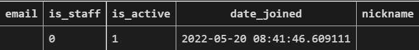
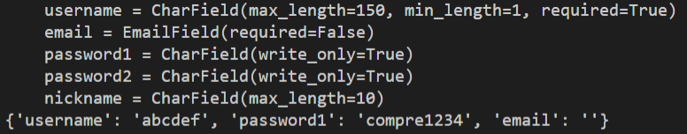
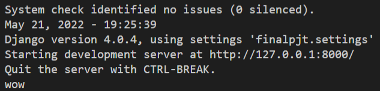
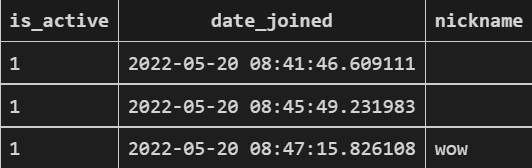

## Django allauth Signup 폼 커스터마이징


Django allauth에서는 기본적으로 Signup 폼을 제공해준다.


제공해주는 폼에는 username과 password1, password2 필드가 존재한다. 내부적으로는 email 필드가 존재하나 필수적인 요소로 보이지 않는다.


구글 검색을 통해 Signup 폼을 커스터마이징하는 방법으로 

1. RegisterSerializer와 DefaultAccountAdapter를 각각 상속받는 클래스를 구현한다.
2.  User 모델을 커스터마이징한다.
3. settings.py에서 AUTH_USER_MODEL를 설정하고 RegisterSerializer와 Adapter를 커스터마이징한 클래스로 등록한다.


이와 같은 과정으로 이루어져 있는 것을 확인할 수 있다.

이를 이용해 nickname 필드를 새로 만들어 이를 적용해보려 했다.


```python
# accounts/models.py

from django.contrib.auth.models import AbstractUser
from django.db import models

# user 필드에 nickname 필드 추가
class User(AbstractUser):
    nickname = models.CharField(max_length=10)

# accounts/serializers.py

from rest_framework import serializers
from dj_rest_auth.registration.serializers import RegisterSerializer

# RegisterSerializer에 nickname 필드 추가
class CustomRegisterSerializer(RegisterSerializer):
    nickname = serializers.CharField(max_length=10)

# accounts/adapters.py

from allauth.account.adapter import DefaultAccountAdapter

class CustomAccountAdapter(DefaultAccountAdapter):
# 조상 save_user에서는 user를 매개변수로 받아서 user의 field 값을 넣어주고 save()를 한 후 이를 반환한다. 
# 자손 클래스에서 이 메서드를 오버라이딩을 하여 nickname field 값을 넣어주고 save()를 한 후 이를 반환하였다. 
    def save_user(self, request, user, form, commit=True):
        data = form.cleaned_data
        user = super().save_user(request, user, form, False)
        nickname = data.get("nickname")
        user.nickname = nickname
        user.save()
        return user
```





포스트맨을 이용해서 user를 생성해보지만 nickname 필드에 값이 들어가지 않는다.


```python
class CustomAccountAdapter(DefaultAccountAdapter):
    def save_user(self, request, user, form, commit=True):
        print(form)
        data = form.cleaned_data
        print(data)
        user = super().save_user(request, user, form, False)
        nickname = data.get("nickname")
        user.nickname = nickname
        user.save()
        return user
```


data에 nickname key값이 들어오는 지 확인하기 위해 form과 data를 출력해보았다.





form에는 필드가 추가 되어있었으나 data에 nickname key값이 존재하지 않는다.

아마 상속받아 필드를 추가하는 과정에서 오버라이딩을 추가로 해야하는 부분이 더 있는 듯하다.

조상 클래스인 RegisterSerializer 클래스를 확인해본 결과 의심스러운 메서드가 하나 있었다.

form.cleaned_data에서 새로 만든 필드가 유효성검사를 통과하지 못해 data에 적용되지 못한 것으로 보이는데 RegisterSerializer클래스에 get_cleaned_data라는 메서드가 존재한다. allauth signup 과정에서 이 메서드를 call하는 지 확인하기 위해 아무 의미없는 문자열을 하나 출력해봤다.


```python
def get_cleaned_data(self):
        print("wow")
        return {
            'username': self.validated_data.get('username', ''),
            'password1': self.validated_data.get('password1', ''),
            'email': self.validated_data.get('email', ''),
        }
```





문자열이 출력되는 것으로 보인다. 아마 get_cleaned_data를 통해 유효성 검사를 진행하는 듯하다.

커스터마이징한 serializer 클래스에서 get_cleaned_data 메서드를 재정의하고 다시 user 생성을 해보았다.


```python
from rest_framework import serializers
from dj_rest_auth.registration.serializers import RegisterSerializer

class CustomRegisterSerializer(RegisterSerializer):
    nickname = serializers.CharField(max_length=10)
# self.validated_data는 RegisterSerializer에서 get_cleaned_data에 있던 형식을 가져왔다.
    def get_cleaned_data(self): 
        cleaned_data = super().get_cleaned_data() 
        cleaned_data['nickname'] = self.validated_data.get('nickname', '') 
        return cleaned_data
```





nickname 필드에 값이 잘 저장되어 데이터베이스에 들어간 것을 확인할 수 있다.